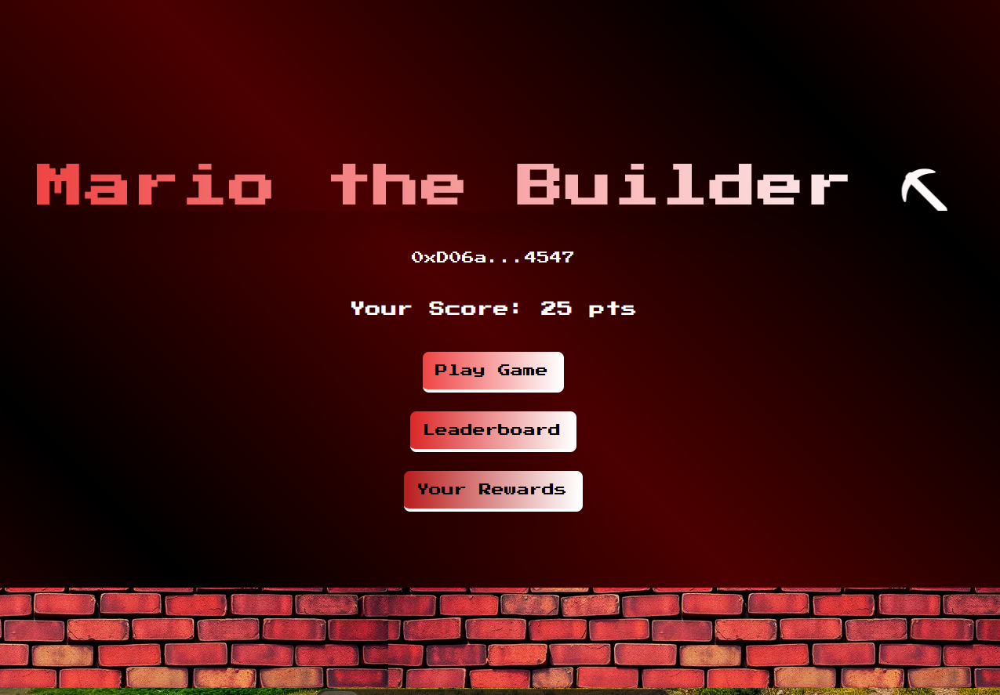

### Mantler Mind Mining -
is the Mantle Sepolia based Telegram Bot game which helps one to simulate the transaction mining and gaining rewards based on the order and time of block mining.



Here is the deployed contract on Mantle Sepolia Testnet:
[0xC348BdE8FE8a268951313094358C386F6e523a41](https://explorer.sepolia.mantle.xyz/address/0xc348bde8fe8a268951313094358c386f6e523a410)


#### Getting Started

Staring the frontend:
- ```cd frontend```
- ```npm run dev```


Starting the backend bot server(add the keys in the .env files):
- ```cd backend```
- ```npm run dev```

This is a simulation game which involves mining transactions and rewards using NFTs on a Mantle blockchain known for its speed and scalability. Users will learn how to play the game by the user-friendly commands, process transactions, and earn rewards based on their choices. The project aims to educate users on blockchain basics and may expand with new features in the future.

The game involves the mining of blocks based on the Fee, Xtrafee and the Time , which makes it easy for user to visualize the under hood of the blockchain mining on the miner side. This game educates the user about the different transaction details logged while the execution of the transaction and simualte it to the user in a very fun and enjoyable manner.

The user can claim NFTs with the earned points - like at 500pts, 1000pts and so on.
